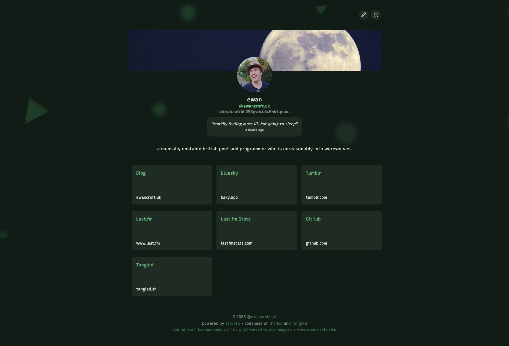

# WhiteBreeze (Personal Fork)



A customised version of [WhiteBreeze](https://github.com/hugeblank/whitebreeze), a small frontend for [WhiteWind](https://whtwnd.com/) - a Markdown blog service using [ATProto](https://atproto.com/).

This fork serves as both my personal website and blog, modified for personal usage while maintaining the original functionality of allowing self-hosting WhiteWind blog posts.

**_This repository is available on [GitHub](https://github.com/ewanc26/website) and [Tangled](https://tangled.sh/did:plc:ofrbh253gwicbkc5nktqepol/website). GitHub is the primary version, and the Tangled version is a mirror._**

## Project Structure

### Configuration Files

- `.cspell.json`: Configuration for spell checking
- `.npmrc`: NPM configuration file
- `.prettierignore`: Files to ignore for Prettier formatting
- `.vercelignore`: Files to ignore for Vercel deployments
- `compose.yaml`: Docker Compose configuration
- `eslint.config.js`: ESLint configuration
- `package.json`: Project dependencies and scripts
- `postcss.config.js`: PostCSS configuration
- `svelte.config.js`: Svelte configuration
- `tailwind.config.ts`: Tailwind CSS configuration
- `tsconfig.json`: TypeScript configuration
- `vite.config.ts`: Vite build configuration

### Source Code

- `src/`: Main application source
  - `app.css`: Global CSS styles
  - `app.html`: Main HTML template
  - `lib/`: Shared components and utilities
    - `components/`: Reusable Svelte components
      - `profile/profile.ts`: Shared logic for fetching and caching ATProto profile data, used by both the root and blog layouts.
    - `dateFormatter.ts`: Date formatting utilities
    - `parser.ts`: Content parsing utilities
  - `routes/`: Application routes
    - `+layout.svelte`: Root layout component
    - `+layout.ts`: Layout server-side code (imports profile logic from `lib/components/profile/profile.ts`)
    - `+page.svelte`: Home page component
    - `blog/`: Blog-related routes (also imports profile logic from `lib/components/profile/profile.ts`)
    - `info/`: Information page routes

### Static Assets

- `static/`: Static files served directly
  - `.well-known/atproto-did`: AT Protocol DID configuration
  - `Screenshot.png`: Website screenshot
  - `embed/`: Social media embed images
  - `favicon/`: Favicon and related assets
  - `lexicons/`: Lexicon configuration

### Developmental and Deployment

- `Dockerfile`: Docker container configuration
- `LICENSE`: Project license
- `README.md`: Project documentation
- `package-lock.json`: Lockfile for dependencies
- `website.code-workspace`: VS Code workspace settings

## Usage

### Development

```sh
npm install
npm run dev
```

### Production

Change environment variables:

```env
PUBLIC_HANDLE="myhandle.bsky.social" # Your handle, or DID
```

For optimal usage, you need the following record types in your [AT Protocol repository](https://atproto.com/specs/repository):

- `app.bsky.actor.profile`: Your profile
- `com.whtwnd.blog.entry`: Your blog posts
- `blue.linkat.board`: Your links
- `uk.ewancroft.now`: Your status, although it's not required

#### Standalone

```sh
npm install
npm run build
node index.js
```

Put environment variables ahead of the last command, port can also be configured with `PORT`.

#### Dockerised

Modify `docker-compose.yaml` and change the host port if necessary.

```sh
docker compose up -d
```
